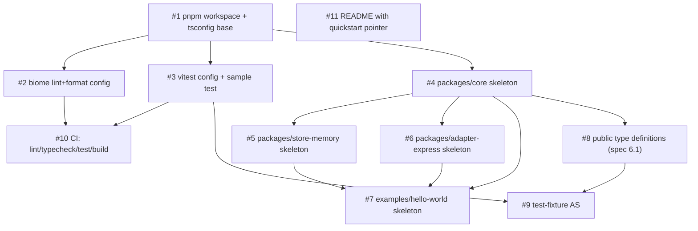
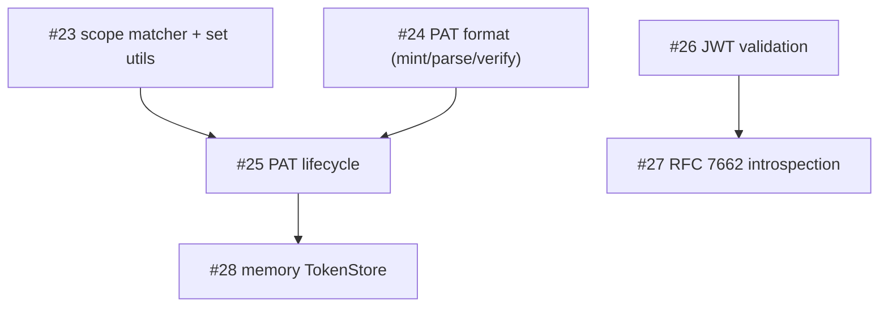
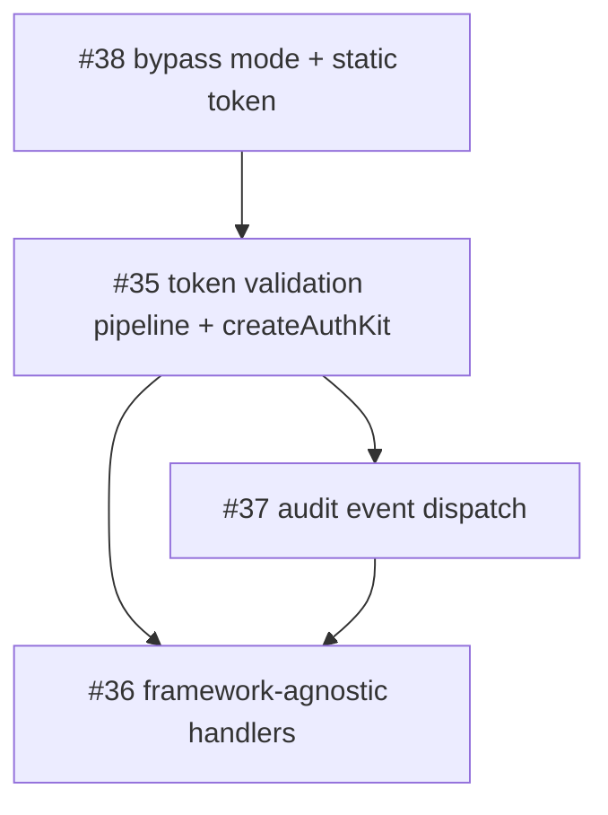
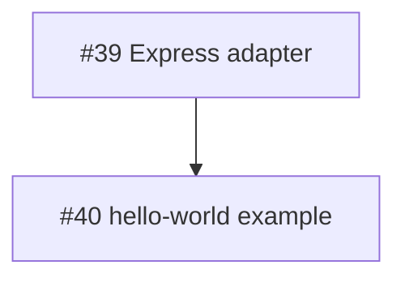
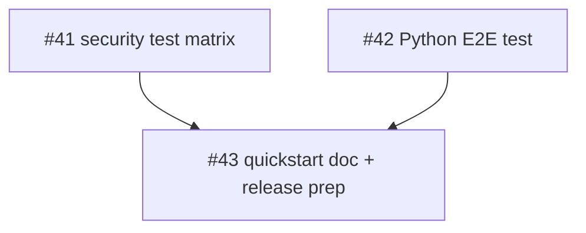

# Dependency Graph

Generated by the `plan-issues` skill. Update when issues are added,
closed, or re-scoped.

## Stage 0 (complete)

All issues closed.

## Reading the graph

- **No blockers (start here):** #1, #11.
- **Unblocks the most:** #1 (gates #2, #3, #4, and transitively
  everything else); #4 (gates all package skeletons + types).
- **Leaves:** #7 (hello-world skeleton), #9 (AS fixture), #10 (CI),
  #11 (README). Stage 0 is "done" when all leaves close.

## Recommended starting issue (Stage 0)

**#1 — `chore: pnpm workspace + tsconfig base`.** Every package
skeleton and tooling issue is blocked on it. #11 (README) can be done
in parallel by a second contributor since it has no dependencies.

## Stage 1 (complete)

All issues closed.

## Stage 2 (active)

### Reading the graph

- **No Stage 2 blockers (start here):** #38 (bypass mode) and #35 (pipeline).
  #38 is a clean prerequisite with no Stage 2 dependencies; #35 can begin
  immediately since all Stage 1 primitives are closed.
- **Unblocks the most:** #35 gates both #36 and #37; all three must close
  before Stage 3 can start.
- **Leaves:** #36 (handlers) and #37 (audit). Stage 2 is done when both close.

### Recommended starting issue (Stage 2)

**#35 — token validation pipeline + `createAuthKit` factory.** It is the
central wiring point for all Stage 1 primitives and gates everything else
in Stage 2. **#38 (bypass mode)** is a clean parallel start.

## Stage 3 (pending Stage 2)

### Reading the graph

- **No Stage 3 blockers:** #39 (Express adapter) opens when #36 closes.
- **Leaf:** #40 (hello-world). Stage 3 is done when #40 closes.

### Recommended starting issue (Stage 3)

**#39 — Express adapter.** Thin wrapper; opens immediately after #36.

## Stage 4 (pending Stage 3)

### Reading the graph

- **No Stage 4 blockers:** #41 opens when #36/#37/#38 close; #42 opens when #40 closes.
- **Leaf:** #43 (release prep). Stage 4 — and v0.1 — is done when #43 closes.

### Recommended starting issue (Stage 4)

**#41 — security test matrix.** Can run in parallel with #42 once Stage 3 is done.
