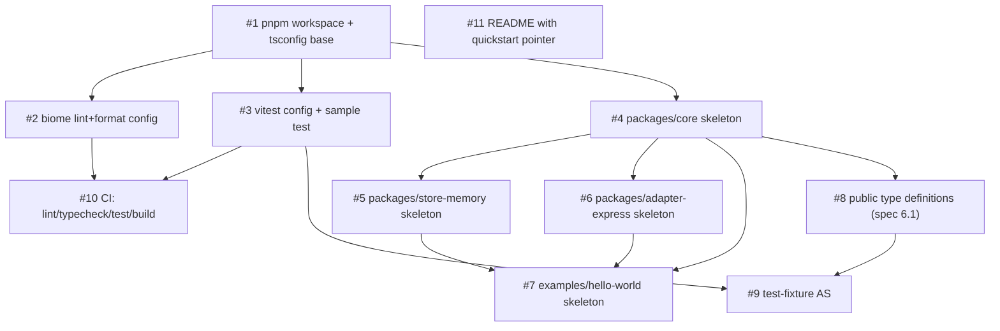
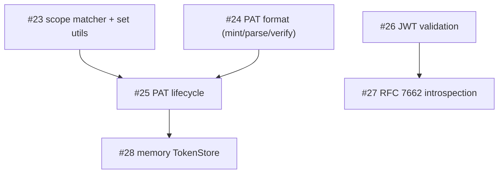

# Dependency Graph

Generated by the `plan-issues` skill. Update when issues are added,
closed, or re-scoped.

## Stage 0 (complete)

All issues closed.

## Reading the graph

- **No blockers (start here):** #1, #11.
- **Unblocks the most:** #1 (gates #2, #3, #4, and transitively
  everything else); #4 (gates all package skeletons + types).
- **Leaves:** #7 (hello-world skeleton), #9 (AS fixture), #10 (CI),
  #11 (README). Stage 0 is "done" when all leaves close.

## Recommended starting issue (Stage 0)

**#1 — `chore: pnpm workspace + tsconfig base`.** Every package
skeleton and tooling issue is blocked on it. #11 (README) can be done
in parallel by a second contributor since it has no dependencies.

## Stage 1 (active)

### Reading the graph

- **No Stage 1 blockers (start here):** #23 (scope matcher),
  #24 (PAT format), #26 (JWT validation). All three can run in
  parallel.
- **Unblocks the most:** #24 and #23 both gate #25 (PAT lifecycle),
  which in turn gates #28 (memory store).
- **Leaves:** #27 (introspection), #28 (memory store). Stage 1 is
  "done" when both leaves close along with the matcher (#23).

### Recommended starting issue (Stage 1)

**#23 — scope matcher.** It's a self-contained, pure module that
gates the PAT lifecycle's scope-intersection logic and the eventual
Stage 2 tool dispatcher. **#24 (PAT format)** and **#26 (JWT
validation)** are equally good parallel starts for additional
contributors.
